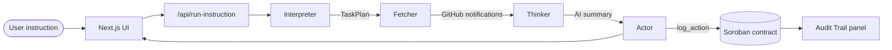

# flowms

**Natural-language instructions, executed by agents, logged on-chain.**

Give flowms a plain-English instruction — for example, *"Summarize my GitHub notifications"* — and a three-agent pipeline interprets it, fetches the data, acts on it, and writes an immutable audit entry to a Soroban smart contract on Stellar testnet. Every step is verifiable: the UI shows live agent activity, and the Audit Trail view reads the full on-chain history from the workspace sidebar.

**Problem:** AI agents often act on your behalf with no durable, public record of *what* ran, *when*, and *with what outcome*. flowms treats transparency as a first-class feature: the agent pipeline is visible in real time, and the Actor agent persists each action to an append-only Soroban contract so anyone can inspect the log.

**Live demo:** [https://flowms.vercel.app](https://flowms.vercel.app)

---

## Table of contents

- [Architecture](#architecture)
- [Tech stack](#tech-stack)
- [Smart contract](#smart-contract)
- [Screenshots](#screenshots)
- [Local development](#local-development)
- [Deploy to Vercel](#deploy-to-vercel)
- [Monitoring & feedback](#monitoring--feedback)
- [Known limitations & roadmap](#known-limitations--roadmap)
- [Project structure](#project-structure)
- [License](#license)

---

## Architecture

flowms runs a linear **Interpreter → Fetcher → Thinker → Actor** pipeline. Each agent has a narrow job; only the Actor writes to Stellar.



| Agent | Responsibility | Side effects |
|---|---|---|
| **Interpreter** | Validates natural language and builds a structured `TaskPlan` | None |
| **Fetcher** | Reads unread GitHub notifications via the GitHub API | Read-only |
| **Thinker** | Summarizes fetched data with Gemini AI | None |
| **Actor** | Logs the action hash and summary outcome to Soroban | On-chain write |

**Signing model:** Soroban transactions are signed server-side with a dedicated testnet account (`STELLAR_SECRET_KEY`) so pipeline runs do not require repeated Freighter popups. Freighter is still required in the UI so users connect a Stellar testnet identity; the connected wallet gates API access.

**Trust layer:** The Audit Trail panel calls `get_action_count` and `get_actions` directly against the deployed contract via Soroban RPC — not session history — so the log reflects everything recorded on-chain.

---

## Tech stack

| Layer | Technology |
|---|---|
| Frontend | Next.js 16 (App Router), React 19, Tailwind CSS 4 |
| Auth | NextAuth.js + GitHub OAuth |
| Wallet | Freighter (`@stellar/freighter-api`) |
| Agents | TypeScript modules in `lib/agents/` |
| Blockchain | Stellar testnet, Soroban (`@stellar/stellar-sdk`) |
| Smart contract | Rust (`soroban-sdk`), crate `flowms-action-log` |
| Validation | Zod |
| Analytics | Vercel Web Analytics |
| Error monitoring | Sentry (optional) |
| Runtime | Bun or Node.js 20+ |

---

## Smart contract

Append-only audit log on **Stellar Testnet**. Each pipeline run appends one `ActionLog` entry with agent id, action type, tool, instruction hash, and timestamp.

| Field | Value |
|---|---|
| **Contract ID** | `CD3JPZA3CQUX6NZMXK4BPA5MQ4WLWA5NI32KWFPQXSAMGYIDWJILPAVC` |
| **Network** | Stellar Testnet (`Test SDF Network ; September 2015`) |
| **RPC** | `https://soroban-testnet.stellar.org` |
| **Source** | [`contracts/src/lib.rs`](./contracts/src/lib.rs) |
| **Deployment tx** | [View on Stellar Expert](https://stellar.expert/explorer/testnet/tx/7eb1ed872d91777ba6d21e28ec7227911ef8dd20437e18d1418322643f2c9354) |
| **Contract explorer** | [View contract](https://stellar.expert/explorer/testnet/contract/CD3JPZA3CQUX6NZMXK4BPA5MQ4WLWA5NI32KWFPQXSAMGYIDWJILPAVC) |

### Contract functions

| Function | Description |
|---|---|
| `log_action(agent_id, action_type, tool, instruction_hash, timestamp) -> u64` | Append one immutable log entry; returns sequential id |
| `get_action(id) -> ActionLog` | Read a single entry by id |
| `get_action_count() -> u64` | Total number of logged actions |
| `get_actions(start, limit) -> Vec<ActionLog>` | Paginated audit trail (max 100 per call) |

Build, test, and deploy instructions: [`contracts/README.md`](./contracts/README.md).

---

## Screenshots

Replace each placeholder with a captured PNG saved under `docs/screenshots/`.

| Placeholder | What to capture |
|---|---|
| `[INSERT SCREENSHOT: desktop chat UI]` | Workspace view after a successful run — instruction input, live activity feed, summary, and Stellar Expert link |
| `[INSERT SCREENSHOT: mobile view]` | Same flow at ~390px width — collapsible sidebar, chat input, stacked layout |
| `[INSERT SCREENSHOT: audit trail]` | Audit Trail view from the sidebar — paginated on-chain history with proof links |
| `[INSERT SCREENSHOT: analytics dashboard]` | Vercel → Project → Analytics — page views and custom events |

Suggested filenames once captured:

```
docs/screenshots/desktop-chat.png
docs/screenshots/mobile-view.png
docs/screenshots/audit-trail.png
docs/screenshots/analytics-dashboard.png
```

Then embed in this section, e.g. ``.

---

## Local development

### Prerequisites

- [Bun](https://bun.sh) (recommended) or Node.js 20+
- GitHub account (for OAuth)
- [Freighter](https://www.freighter.app/) browser extension on **Stellar testnet**
- Funded Stellar **testnet** account for server signing

### 1. Clone and install

```bash
git clone https://github.com/MisbahAnsar/flown
cd flown
bun install
```

### 2. Environment variables

```bash
cp .env.local.example .env.local
```

| Variable | Required | Description |
|---|---|---|
| `NEXTAUTH_SECRET` | Yes | Session encryption — `openssl rand -base64 32` |
| `NEXTAUTH_URL` | Yes | `http://localhost:3000` locally |
| `GITHUB_ID` | Yes | GitHub OAuth App client ID |
| `GITHUB_SECRET` | Yes | GitHub OAuth App client secret |
| `STELLAR_NETWORK_PASSPHRASE` | Yes | Default testnet value in example file |
| `STELLAR_RPC_URL` | Yes | Default Soroban testnet RPC in example file |
| `STELLAR_CONTRACT_ID` | Yes | Deployed contract ID (default in example file) |
| `STELLAR_SECRET_KEY` | Yes | Server signing key for `log_action` |
| `GEMINI_API_KEY` | Yes* | Google Gemini API key for Thinker summaries (*falls back to template summary if unset) |
| `GEMINI_MODEL` | No | Gemini model id (default: `gemini-2.0-flash`) |
| `NEXT_PUBLIC_SENTRY_DSN` | No | Sentry error monitoring |
| `NEXT_PUBLIC_VERCEL_ANALYTICS_ENABLED` | No | Set `true` to test analytics locally |

`.env.local` is gitignored. Never commit secrets.

### 3. GitHub OAuth App (local)

Create an app at [github.com/settings/developers](https://github.com/settings/developers):

| Field | Value |
|---|---|
| Homepage URL | `http://localhost:3000` |
| Authorization callback URL | `http://localhost:3000/api/auth/callback/github` |

Scopes used: `read:user`, `user:email`, `notifications`.

> GitHub allows **one callback URL per OAuth App**. Use a separate app for production (see [Deploy to Vercel](#deploy-to-vercel)).

### 4. Stellar testnet signing account

1. Create/fund a testnet account ([Stellar Laboratory Faucet](https://laboratory.stellar.org/#account-creator?network=test)).
2. Set `STELLAR_SECRET_KEY` in `.env.local`.

### 5. Run

```bash
bun dev          # http://localhost:3000
bun test lib     # unit tests (21 tests)
bun run build    # production build
cd contracts && cargo test   # contract tests
```

**First-run flow:** Connect Freighter (testnet) → open **Workspace** in the sidebar → connect GitHub in the chat bar → send *Summarize my GitHub notifications* → switch to **Audit Trail** in the sidebar. The workspace has no top navbar; navigation and disconnect actions live in the sidebar.

---

## Deploy to Vercel

1. Import the repo at [vercel.com/new](https://vercel.com/new).
2. Create a **production** GitHub OAuth App:
   - Homepage: `https://flowms.vercel.app`
   - Callback: `https://flowms.vercel.app/api/auth/callback/github`
3. Set all env vars from `.env.local.example` in Vercel → Settings → Environment Variables.
   - `NEXTAUTH_URL` must be `https://flowms.vercel.app` exactly.
4. Enable **Web Analytics** on the Vercel project (optional but recommended).
5. Deploy and verify: GitHub sign-in, wallet connect, instruction run, audit trail load.

---

## Monitoring & feedback

| Signal | Where |
|---|---|
| Page views & custom events | Vercel → Analytics → Events |
| Pipeline / UI errors | Sentry (if `NEXT_PUBLIC_SENTRY_DSN` is set) |
| User feedback | EmailJS email to your inbox + Vercel Runtime Logs (`[flowms:feedback]`) + `feedback_submitted` analytics event |

No GitHub tokens, private keys, instruction text, or wallet addresses are sent to analytics or Sentry. See [`lib/monitoring/scrub.ts`](./lib/monitoring/scrub.ts).

---

## Known limitations & roadmap

**Current MVP limitations:**

- One supported instruction type: summarizing GitHub notifications
- GitHub OAuth required; no other data sources yet
- Soroban logging uses a server-funded account (not user-signed txs)
- Stellar testnet only

**Planned for future levels:**

| Feature | Description |
|---|---|
| **Discord agent** | Read and summarize Discord messages / mentions |
| **Gmail agent** | Fetch and act on email instructions |
| **Memory agent** | Persist context across sessions for multi-step workflows |

These extend the same Interpreter → Fetcher → Actor pattern with new tools and on-chain action types.

---

## Project structure

```
app/           Next.js pages and API routes
components/    UI (landing, sidebar, chat, audit trail, wallet, auth, feedback)
lib/agents/    Interpreter, Fetcher, Actor
lib/pipeline/  Orchestration and API types
lib/stellar/   Soroban client and audit trail reads
lib/github/    GitHub notifications client
contracts/     Soroban smart contract (Rust)
```

Detailed layout and contribution notes: [`CONTRIBUTING.md`](./CONTRIBUTING.md).

---

## Scripts

| Command | Description |
|---|---|
| `bun dev` | Start development server |
| `bun run build` | Production build |
| `bun start` | Serve production build |
| `bun test lib` | Run unit tests |
| `bun run lint` | ESLint |

---

## License

[MIT](./LICENSE)
